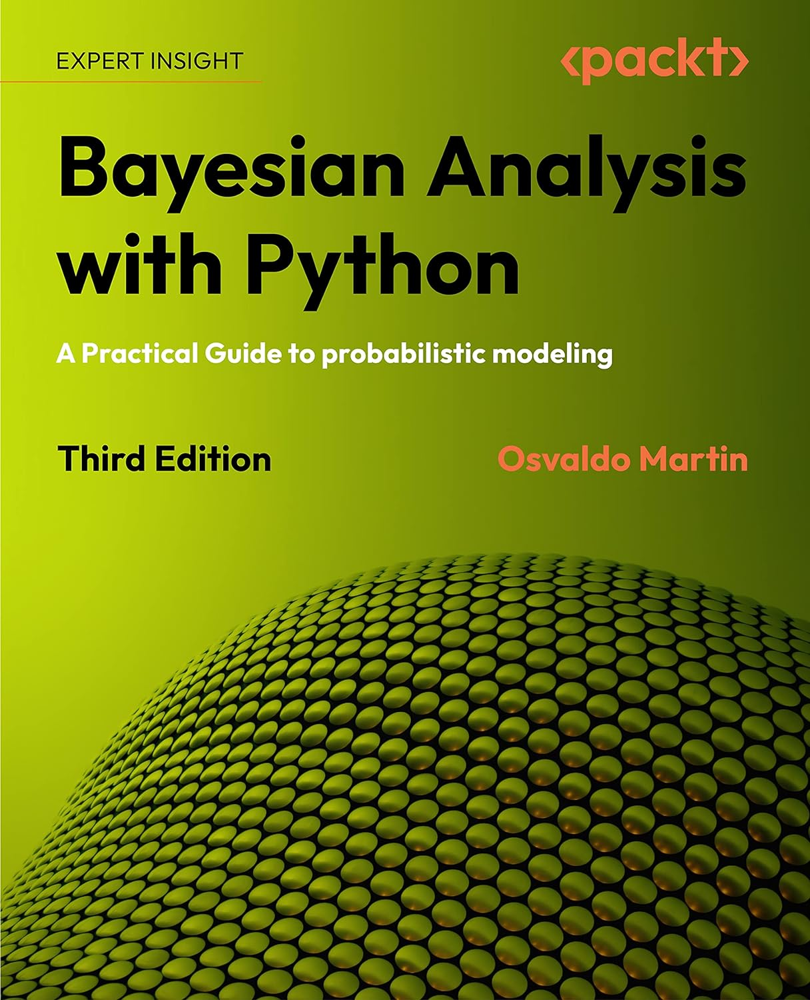

# Bayesian Analysis with Python (Third Edition)

<p align="center">
  <a href="https://packt.link/JrkVW" target="_blank" rel="noopener noreferrer" style="border:none;text-decoration:none"></a></p>

<p align="center">
  <a href="https://packt.link/JrkVW" target="_blank" rel="noopener noreferrer" style="border:none;text-decoration:none">
</p>

This repository contains the code examples from the book

## See a mistake?
If you see any issues please create an issue on [the issue tracker](https://github.com/aloctavodia/BAP3/issues)

## Environment installation
To run the code you will need to install the correct packages in a computational environment.
We have provided instructions below for common options.

### Conda
```
conda env create -f bap3.yml
conda activate bap3
```

### pip
```
pip install pymc==5.8.0 arviz==0.16.1 bambi==0.13.0 pymc-bart==0.5.2 kulprit==0.0.1 preliz[full,notebook]==0.3.6 nutpie==0.9.1
```

### Citation

If you use this book in your own work, please cite it using

Martin Osvaldo A, Bayesian Analysis with Python. Packt Publishing. 2024. ISBN 978-1-80512-716-1

Here is the citation in BibTeX format

```
@book{martin_bap_2024,
	title = {Bayesian {Analysis} with {Python}: {A} {Practical} {Guide} to probabilistic modeling, 3rd {Edition}},
	isbn = {978-1-80512-716-1},
	shorttitle = {Bayesian {Analysis} with {Python}},
	language = {English},
	publisher = {Packt Publishing},
	author = {Martin, Osvaldo A},
	month = feb,
	year = {2024},
}
```

### Donation

This book is only possible because of open-source contributors working on the projects we used. If you like this book we encourage you to donate to [ArviZ](https://numfocus.org/donate-to-arviz) or [PyMC](https://numfocus.org/donate-to-pymc). 

If instead, you want to donate directly to me, the author, please do it at [ko-fi](https://ko-fi.com/aloctavodia) 

